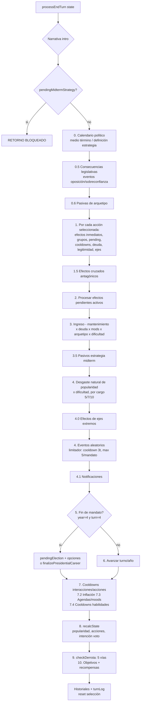

# GobernArg — Reporte 3: Arquitectura del Engine de Juego

**Analista:** Arquitecto_Engine
**Fecha:** 2026-09-20
**Proyecto:** `project-bolt-sb1-dzgqso GobernArg 21-11/project`
**Stack:** React 18 + TypeScript + Vite + Tailwind + Radix UI + Vitest. 100% client-side, sin backend.
**Alcance:** `src/engine/` (12 archivos, ~2.565 LOC), `src/systems/effects|events/types.ts`, `src/types/game.ts`, `src/lib/effect-helpers.ts`, `src/lib/risk.ts`, `src/lib/groups-mapping.ts` y utils satélites (`electionSystem`, `popularidad`, `actionEffects`, `victoryConditions`, `crossGroupEffects`, `actionCalculator`, `interactionCosts`).

---

## 1. Modelo de datos central (`src/types/game.ts`)

`GameState` es un **objeto plano y monolítico de ~85 campos** que concentra TODO el estado: progresión (position, term, year, turn 1-4 cíclico), indicadores (popularity, budget, stability, legitimacy, votingIntention), relaciones con grupos (`groupRelations: Record<string, number>`), memoria de decisiones (`actionUsageCount`, `actionCooldowns`, `completedActions`, `turnLog`), efectos diferidos (`pendingEffects`), sistema político (legislativeSupport, midtermStrategy, ejes ideológicos), agendas de grupos (groupAgendas, groupMoods, negotiationPending, temporarySupportBonuses) y contadores de derrota (consecutiveLowPopularity, impeachmentConsecutiveTurns, etc.).

Observaciones clave del modelo:

- **Turno cíclico + turno global.** `state.turn` va de 1 a 4 y se reinicia cada año; toda aritmética de deadlines/cooldowns/activación debe usar `getGlobalTurn(state) = (year-1)*4 + turn` (engineShared). El propio código documenta que `turn + N` "nunca se cumple cuando el deadline cae en otro año" — es la invariante más delicada del sistema.
- **Campos `_archetype*` no persistidos**: el arquetipo se "compila" a acumuladores (incomeBonus, extraLoans, electionRetention, eventResilience, freeInteractions, extraActions) en `applyArchetypePassives` cada turno. Es un patrón de *materialized view* sobre los datos del arquetipo.
- **Duplicación de tipos de eventos**: `EventType`, `EventConditions`, `EventEffect(s)`, `GameEvent`, `EventChoice` existen **dos veces** (idénticos) en `types/game.ts` y `systems/events/types.ts`. El engine importa los de `systems/events/types`, pero la doble definición es deuda técnica real (dos fuentes de verdad).
- **Opcionales que nunca son undefined**: `interestGroups?`, `unlockedActions?`, `groupAgendas` (se inicializan siempre) obligando a `?? []` y `|| []` por todo el código.
- **Campos legacy en `Subgroup`**: `supportMultiplier`, `resourceDemand`, `satisfactionLevel`, `lastInteractionEffect`, `support?` no tienen consumo en el engine analizado.
- **Dos modelos de grupos superpuestos**: los 18 subgrupos del juego (`interestGroups`) vs. los 9 grupos "visibles" del rediseño (`FIXED_GROUPS` en `groups-mapping.ts`, mapeo muchos-a-uno). El engine opera sobre subgrupos; la UI agrega.

---

## 2. Módulos del engine

### 2.1 `gameEngine.ts` (505 LOC) — fachada + interacciones de jugador
Responsabilidad: creación de partida, interacciones con grupos (`applyInteraction`), asesores, habilidades especiales de arquetipo, satisfacer demandas. **Actúa además como fachada que re-exporta** todo el resto del engine (acciones, eventos, elecciones, turno).

- `createNewGame(position, archetype, ...)`: inicializa estado; presupuesto = `POSITION_STARTING_BUDGET[position] + 500 si empresario`; popularidad inicial por arquetipo (comunicador 70, resto 50). Aplica pasivas **dos veces** (la inicial usa el default `politico`; se re-aplica con el arquetipo elegido — workaround documentado en el código).
- `applyInteraction`: puro. Costos en `utils/interactionCosts.ts`: reunión $10; negociar `influence * 25`; conceder `influence * 45` (0 si el grupo está en `_archetypeFreeInteractions`). Ganancias: +2 / +4 / +15 apoyo. Reglas de diseño: máx 4 concesiones por mandato; conceder exige ≥1 reunión o negociación previa; costo cruzado `max(2, round(influence*0.5))` de rechazo a todos los demás grupos.
- `useSpecialAbility`: aplica efectos/costos con cooldown por habilidad.
- `satisfyGroupDemand`: consume 1 acción; +5 apoyo al grupo; penalización a antagonistas (`round(5 * ratio)`); +1 popularidad; resetea mood a 'contento'.

### 2.2 `turnProcessor.ts` (613 LOC) — corazón del juego
`processEndTurn(gameState) → TurnResult { state, summary, triggeredEvents, narrative }`. Es una función **larga y secuencial** (pasos 0–10) que orquesta a todos los demás módulos. Detalle del flujo en la sección 3.

### 2.3 `electionEngine.ts` (125 LOC) — elecciones generales
- `resolvePendingElection(state, option)`: usa `processElectionResultsForOption` (utils/electionSystem). Victoria si `votesPercentage >= 45`. En derrota: `gameOver = true, defeatReason = 'election_loss'`.
- En victoria: ascenso/reelección vía `getNextPosition`, **reset completo de mandato** (año/turno a 1/1, `popularity = round(popularity*0.7 + 30)`, `budget = POSITION_STARTING_BUDGET + round(budget*0.1)`, y ~20 campos reseteados), y `recalcState`.
- `finalizePresidentialCareer`: último mandato presidencial sin opciones → `gameOver`, `victorious = checkVictoryConditions` (todos los objetivos + popularidad ≥ 60 + presupuesto > 0).

**Fórmula de intención de voto** (`utils/electionSystem.ts::calculateVotingIntention` — fuente única tras el fix 2.2ada3 "unificar fórmula de intención de voto"; `recalcState` la usa para el panel):

```
votingIntention = popularityImpact*0.35 + budgetImpact*0.15 + groupsSupport*0.15
                + objectivesImpact*0.15 + stability*0.05 + activityImpact*0.15
```
- `popularityImpact` = promedio de `historicalPopularity` últimos 4 trimestres.
- `budgetImpact` = `clamp(50 + growthRate/2, 0, 100)` donde `growthRate = (current - initial)/initial * 100`.
- `groupsSupport` = **promedio ponderado por influencia** de `groupRelations`.
- `objectivesImpact` = `completed/total * 100`.
- `activityImpact` = `min(100, accionesEnTurnLog/16 * 100)` (penaliza inacción).
- Pasiva político (retención): `VI += retention * (100 - VI)`.
- Para opciones concretas: `adjusted = (base + PROMOTION_DIFFICULTY[option]) * ascensionMultiplier`, clamp 0–100.

### 2.4 `eventResolver.ts` (378 LOC) — eventos y legislatura
- **Elecciones de medio término** (`processCalendarEvents`): en el calendario, el turno `elecciones-medio-termino` dispara `calculateLegislativeResults`:
  ```
  officialismVotes = 35 + (avgPopularity4T-50)*0.25 + (avgGroupSupport-50)*0.15
                   + objectives*10% + (stability-50)*0.1 + ruido(±3)
  officialismVotes = clamp(v, 28, 58)
  legislativeSupport = clamp(officialismVotes * 1.1, 25, 75)
  ```
  Outcomes por umbral: >45 landslide, >42 clear, >37 tie, >34 minority, sino defeat; estabilidad ±10/5/−3/−8/−15.
- `resolveLegislativeConsequences`: con apoyo <35 → 45% de evento de oposición; <38 → 25%; >45 → 25% de evento de sobreconfianza.
- **Limitador global de eventos aleatorios** (`resolveRandomEvents`): cooldown global de 3 turnos tras cualquier random/crisis + máx 5 random por mandato + 1 solo por turno. Los **triggered NO están limitados** (pueden dispararse todos los turnos si cumplen condiciones — decisión de diseño documentada). Las crisis se evalúan antes que los random y su probabilidad se multiplica por `crisisProbabilityMultiplier` de dificultad.
- `checkEventConditions`: filtros de popularidad/presupuesto/estabilidad/emisión/grupos/asesores/acciones/`turnRange` (usando turno global).
- `applyEventEffect`: resiliencia de arquetipo reduce efectos negativos de popularidad/estabilidad: `value *= (1 - _archetypeEventResilience)`.

### 2.5 `axisEngine.ts` (71 LOC) — ejes ideológicos
3 ejes en [-100, 100]: radical↔conciliador, populista↔técnico, cerrado↔convocante. `applyAxisShift` suma shifts por categoría de acción (tabla estática). `getAxisModifiers` activa efectos **solo en extremos (±80)**: modificadores de costo (-1 = −1%), efectividad (×1.10–1.20/×0.85–0.90), y a nivel estado (ej. cerrado-extremo: +5 estabilidad, −10 relaciones).

### 2.6 `archetypeEngine.ts` (89 LOC) — pasivas de arquetipo
`applyArchetypePassives` **reinicia y re-acumula** los `_archetype*` y aplica `extraActions` directo a `baseActions/actions` (duplicando lógica con `actionCalculator`, ver §5). Incluye `getMaxLoans(state) = 3 + _archetypeExtraLoans` — **función sin consumidores** (turnProcessor hardcodea `Math.min(3, ...)`, TODO propio en el código).

### 2.7 `difficultyEngine.ts` (61 LOC)
Tabla de modificadores por dificultad: decay de popularidad (0.5/1.0/1.3/1.5), probabilidad de crisis (0.3/1.0/1.5/2.0), préstamos habilitados (easy/normal sí; hard/legend no), ingreso (1.2/1.0/0.85/0.7). `baseActionsModifier` e `ironman` están **documentados como sin consumir** (config muerta).

### 2.8 `groupAgendaEngine.ts` (255 LOC) — demandas y moods
- `generateGroupAgendas`: máx 2 demandas activas simultáneas; probabilidad `min(0.25, 0.08 + ignoredTurns*0.05)` por subgrupo; respeta pausas por concesión; deadline = turno global + 3–5. Nuevo sistema: la demanda es un `actionId` del registry (Fisher-Yates, filtra por cargo/prerrequisitos/no ejecutada en últimos 3 turnos); legacy: template de texto.
- `updateGroupMoods`: mood por apoyo (≥70 contento, ≥50 neutral, ≥35 disconforme→enojado si 3 turnos ignorado, <35 enojado→radicalizado si 2).
- `applyGroupSatisfactionPenalty`: al vencer deadline, si la acción demandada está en `completedActions` → +10 apoyo y satisfecha; si no → penalización = `round(influence)`.

### 2.9 `legitimacyEngine.ts` (29 LOC)
`calculateLegitimacyChange`: +3 por acciones de cultura/diplomacia; −8 si `popularityChange ≤ -10 y budgetChange ≤ -400`; `−min(5, |popChange|*0.1)` si impopular. `checkLegitimacyCostMultiplier` (legitimidad 0 ⇒ acciones ×2) **sin consumidores en el repo**.

### 2.10 `narrativeEngine.ts` (175 LOC)
Generador de texto (intro de turno, resultados de acción/interacción/elección). Puro, sin efectos. Consume `interestGroups` para nombres.

### 2.11 `actionEngine.ts` (116 LOC) — disponibilidad y selección
`getAvailableActionsForState`: filtra por cargo, cooldown, prerrequisitos (acciones previas, apoyo legislativo, legitimidad, apoyo grupal), presupuesto, popularidad, asesor requerido, apoyo grupal requerido, `unlockedActions`, y préstamos según dificultad. **Costo de reforma**: `isReform = categoría ∈ {economia, infraestructura} O |budgetChange| ≥ 200` (heurística que **ignora el flag `isReform` declarado en los datos**), `actionCost = max(1, 1 + penalty legislativo)` con penalty −1/0/+1/+2 según apoyo ≥45/≥38/≥35/<35.

### 2.12 `engineShared.ts` (148 LOC) — constantes y utilidades
Constantes de balance (ingreso/gastos/presupuesto inicial por cargo, popularidad inicial por arquetipo, umbral de derrota por cargo — **duplicado con `victoryConditions.ts`**), `clampValue`, `getGlobalTurn`, `addNotification` (tope 50, ids con `Math.random`), `recalcState` (recalcula popularidad, acciones e intención de voto), y helpers de estrategia midterm (disponibilidad: 'acelerar' si apoyo >42; 'abrirse' si ≥3 grupos >50; 'jugada_audaz' si comunicador/político o popularidad >65).

**Fórmula de popularidad** (`utils/popularidad.ts`):
```
popularidadGrupos = promedio simple de groupRelations (clamp 0-100)
popularidadTotal  = clamp( max(popularidadPolitica, round(grupos*0.4 + politica*0.6)) )
```
Nota: usa **promedio simple**, mientras la intención de voto usa promedio **ponderado por influencia** — dos agregaciones distintas del mismo dato (ver §5).

**Fórmula de efectos de acción** (`utils/actionEffects.ts::calculateActionEffects`):
```
popularityChange' = popChange * multArquetipo * multAsesor(1.2^n) * multEstrategia
                  * multReunion(1.1) * 0.40 (factor global) * 0.80^usos * multEje
                  (si usos ≥ 5 y popChange > 0 → se invierte a negativo)
budgetChange'     = budgetChange * 0.80^usos * multCostoReduccion * multCostoEje
groupEffect       = popChange * (influence/10) por subgrupo cuyos "interests"
                    aparecen en la descripción de la acción (match de texto!)
```
Además: toda acción con `|budgetChange| ≥ 200` genera mantenimiento diferido (−15% a los 2–4 turnos, −2 pop); infraestructura genera +10% ingresos por 3 turnos; cooldown por defecto: préstamo/emisión 8, >500 → 6, ≥200 → 3, sino 1.

---

## 3. Flujo de un turno completo (`processEndTurn`)



Condiciones de fin de partida (`checkAllDefeatConditions`): (1) popularidad < umbral por cargo (20/25/30) durante 2 turnos consecutivos; (2) presupuesto negativo 2 turnos; (3) impeachment: popularidad <10 + estabilidad <20 durante 2 turnos; (4) golpe institucional: estabilidad <10 + apoyo legislativo <25 durante 3 turnos; (5) hiperinflación: `moneyPrintingCount ≥ 7`. Más `election_loss` en elección. Victoria: finalizar último mandato presidencial con todos los objetivos + popularidad ≥ 60 + presupuesto > 0.

Elecciones: cada 4 años (turno global 16) se marca `pendingElection` y el juego **bloquea el avance**; el jugador elige reelección/ascenso; si presidente sin opciones → cierre de carrera. Medio término (año 3) calcula bancada legislativa que modifica costos de reforma y dispara eventos de oposición/sobreconfianza, y luego obliga a elegir estrategia post-legislativa (que bloquea el siguiente fin de turno hasta definirla).

---

## 4. Evaluación arquitectónica

**Fortalezas**
- Modularización del commit f9b3525 es real y razonable: separación por dominio (elección/eventos/agendas/ejes) con `gameEngine.ts` como fachada, y App.tsx consume una sola API.
- El fix "unificar fórmula de intención de voto" es un acierto: `recalcState` delega en `electionSystem.calculateVotingIntention`, fuente única para panel y elecciones.
- Buenas invariantes documentadas en código: `getGlobalTurn`, clonación manual de `interestGroups` (por los iconos Lucide no serializables), comentarios de "regla de diseño".
- Cobertura de tests de engine (Vitest) sobre turnProcessor, electionSystem, victoryConditions, gameEngine, concesiones.
- Los módulos pequeños (legitimacy, axis, difficulty, narrative) son puros, de entrada/salida claras y fácilmente testeables.

**Debilidades**
1. **Estilo de estado mixto (lo más grave).** `processEndTurn` hace shallow copy y luego **muta profundamente** (`state.budget +=`, `state.groupRelations[x] =`, push a `historicalPopularity`, `checkDefeat` y `applyObjectiveRewards` mutan y devuelven `void`), mientras otras funciones son puras (`applyInteraction`, `applyAxisShift`). Funciones como `recalcState`, `applyCrossGroupEffects` y `applyImmediateEventEffects` mutan su argumento y devuelven lo mismo. Resultado: semántica de inmutabilidad impredecible por archivo — riesgo de bugs silenciosos y de aliasing si el caller reutiliza el estado previo (hoy App.tsx siempre usa el valor de retorno, por lo que no explota).
2. **Acoplamiento por datos global.** Los 12 módulos comparten el God Object `GameState`; casi todas las funciones lo reciben entero aunque usen 3 campos. No hay contratos por subsistema ni reducers tipados por acción.
3. **Duplicación de fuentes de verdad**: umbral de derrota por cargo en `engineShared.DEFEAT_POP_THRESHOLD` y `victoryConditions.LOW_POPULARITY_THRESHOLD`; tipos de eventos duplicados (`types/game.ts` vs `systems/events/types.ts`); dos definiciones de "reforma" (flag de datos vs heurística de `budgetChange ≥ 200`); dos agregaciones de apoyo grupal (simple para popularidad, ponderada para elecciones).
4. **RNG no determinista** (`Math.random()` en ~15 puntos del engine: eventos, elecciones legislativas, demandas, ids). Imposibilita replays, seeds y tests de integración estables. No hay servicio de azar inyectable.
5. **Deuda reconocida en el propio código**: `getMaxLoans` sin cablear (TODO en archetypeEngine); `checkLegitimacyCostMultiplier` sin consumidores; `baseActionsModifier`/`ironman` de dificultad sin consumir; pasivas aplicadas dos veces en `createNewGame`; lógica de `extraActions` duplicada entre `archetypeEngine` y `actionCalculator`.
6. **Tipado laxo en fronteras**: `TurnResult.triggeredEvents: any[]` en engineShared; `import('../types/game')` inline en groupAgendaEngine; `GameEvent` importado de dos lugares distintos según el archivo.
7. **Efectos de grupos por matching de texto** (`subgroup.interests.some(i => action.description.toLowerCase().includes(i))`): acopla el modelo a redacción de descripciones; frágil y no explícito.
8. **Cálculo doble de efectos**: el paso 1.5 de turnProcessor vuelve a llamar `calculateActionEffects` por acción sobre estado ya mutado (usageCount incrementado), pudiendo divergir levemente del paso 1.
9. **Efecto secundario raro**: tras ganar elección, `resolvePendingElection` asigna `votingIntention = votesPercentage`, con lo que la intención de voto del panel "salta" al resultado electoral en lugar de recalcularse.
10. `processEndTurn` (613 LOC, ~60 pasos numerados comentados a mano) es un pipeline monolítico difícil de extender; el orden importa y solo está garantizado por convención.

---

## 5. Fórmulas clave — referencia rápida

| Concepto | Fórmula | Ubicación |
|---|---|---|
| Intención de voto | `0.35·popProm4T + 0.15·budgetScore + 0.15·gruposPond + 0.15·objetivos + 0.05·estab + 0.15·actividad` (+ retención arquetipo) | electionSystem.ts |
| Popularidad total | `max(política, round(grupos·0.4 + política·0.6))`, grupos = promedio simple | popularidad.ts |
| Votos medio término | `35 + (popProm−50)·0.25 + (grupos−50)·0.15 + obj·10% + (estab−50)·0.1 ± 3`, clamp [28,58] | eventResolver.ts |
| Bancada legislativa | `clamp(votos·1.1, 25, 75)` | eventResolver.ts |
| Efecto de acción (pop) | `pop·multArq·1.2^nAsesor·multEstrat·1.1·0.40·0.8^usos·multEje` (invierte si ≥5 usos) | actionEffects.ts |
| Efecto grupo | `popChange·(influencia/10)` si la descripción matchea intereses | actionEffects.ts |
| Ingreso neto/turno | `round(round(round(ingreso·(1−deuda))·(1+mods))·multArq·multDif) − mantenimiento` | turnProcessor.ts |
| Desgaste popularidad | `decayCargo(5/7/10) · multDificultad` | turnProcessor.ts |
| Inflación | `emisión≥3: −5 pop/−$50 por turno; ≥5: −20/−$300; ≥7: derrota` | turnProcessor/victoryConditions |
| Interacciones | reunión +2/$10; negociar +4/`infl·25`; conceder +15/`infl·45`, costo cruzado `max(2, infl·0.5)` | interactionCosts/gameEngine |
| Legitimidad | +3 cultura/diplomacia; −8 decreto forzado; `−min(5, |pop|·0.1)` impopular | legitimacyEngine.ts |

---

## 6. Recomendaciones priorizadas

1. **Unificar el estilo de estado**: elegir inmutabilidad estricta (o mutación controlada con un único `draft`) en `processEndTurn`; eliminar funciones `void` que mutan (`applyObjectiveRewards`, `applyImmediateEventEffects`).
2. **Servicio de RNG inyectable** (`random: () => number` en GameState o módulo) para tests deterministas y replays.
3. **Deduplicar fuentes de verdad**: umbral de derrota (única tabla), tipos de eventos (borrar los de `types/game.ts`), definición de "reforma", agregación de apoyo grupal (elegir simple o ponderada y documentar).
4. **Eliminar dead code**: `getMaxLoans`, `checkLegitimacyCostMultiplier`, modificadores de dificultad sin consumir, campos legacy de `Subgroup`.
5. **Reemplazar el matching de texto** de intereses por un campo explícito `affectedGroups` en `GameAction`.
6. **Extraer el pipeline de turno** en pasos con nombre (array de `StepFn`) para hacer el orden explícito y testeable por paso.
7. Corregir `votingIntention` post-elección para que use `recalcState` en vez del porcentaje electoral.
8. Typear `TurnResult.triggeredEvents: GameEvent[]` y normalizar imports de tipos.
